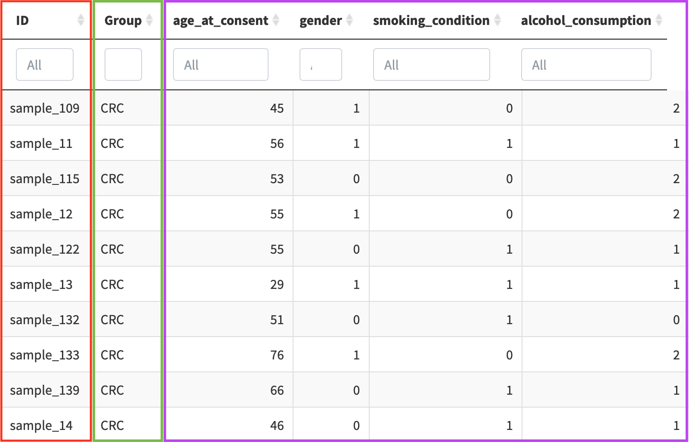
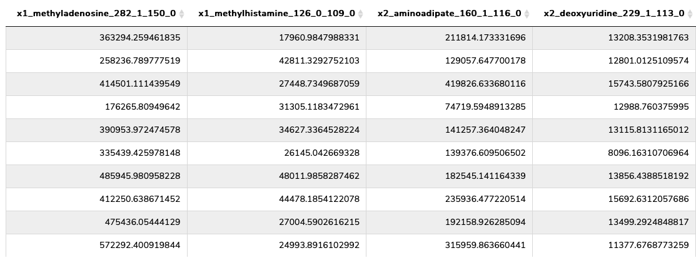
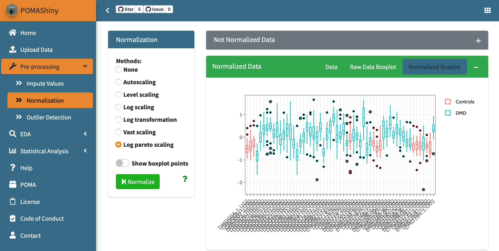
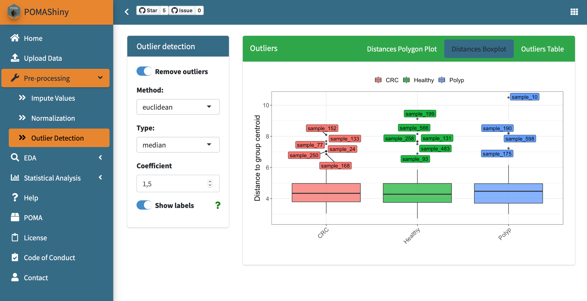
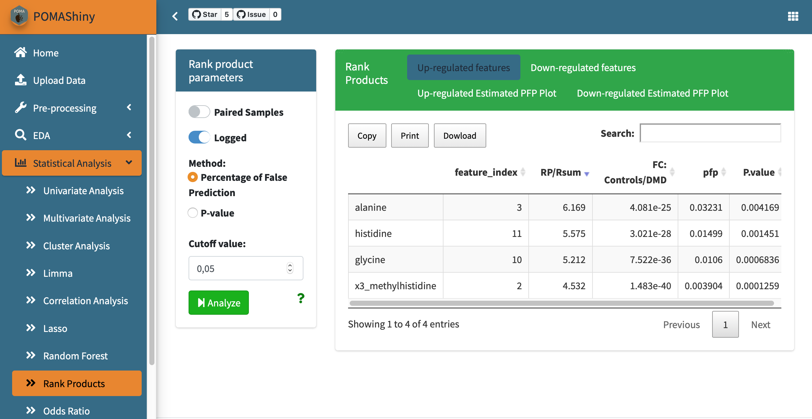
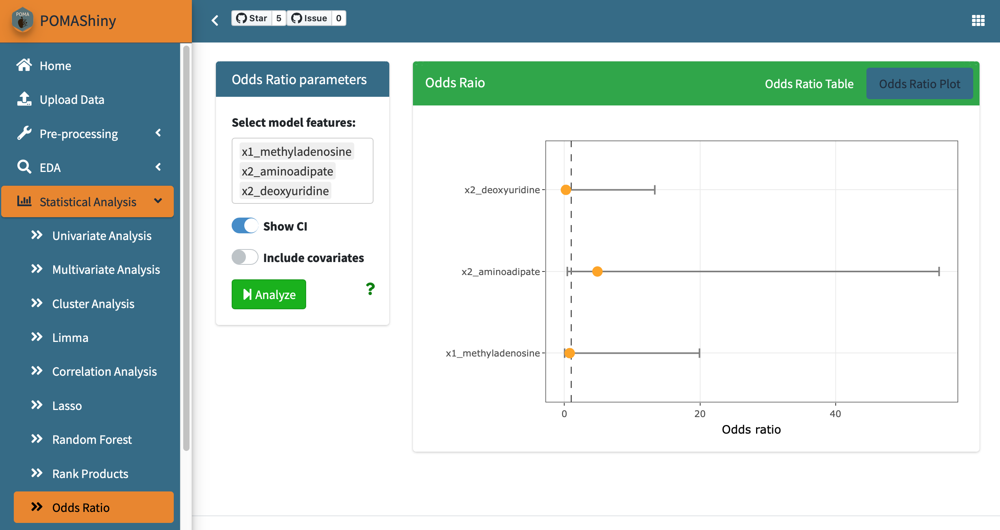

`r paste0("Last update: ", format(Sys.Date(), "%B %d, %Y"))`

### Upload Data Panel

In this panel users can upload their data to be analyzed in POMAShiny. Data format must be a CSV (*comma-separated-value*) file.

#### Target File

A .CSV with two mandatory columns + *n* optional covariates:

  - Each row denotes a sample (the same as in the features file)
  - First/Left-hand column must be sample IDs => red
  - Second/Left-hand column must be sample group/factor (e.g. treatment) => green
  - Covariates (optional): From the third column (included) users can also include several experiment covariates => purple

Once this file has been uploaded, users can select desired rows in the "Target File" panel table to create a subset of the whole uploaded data. If this selection is done, only selected rows are analyzed in POMAShiny, if not (default) all uploaded data are analyzed.

#### Features File

A .CSV with *m* columns:

  - Each row denotes a sample and each column denotes a feature
  - First row must contain the feature names

#### Exploratory report

After uploading the data **and clicking the "Submit" button**, POMAShiny allows users to generate an exploratory data analysis PDF report automatically by clicking the green button with the label "Exploratory report" in the top of the central panel. See a PDF report example [here](https://pcastellanoescuder.github.io/POMA/articles/POMA-eda.html).

#### Example data

POMAShiny includes two example datasets that are both freely available at https://www.metabolomicsworkbench.org. The first example dataset consists of a targeted metabolomics three-group study and the second example dataset consists of a targeted metabolomics two-group study. These two datasets allow users to explore all available functionalities in POMAShiny. Both dataset documentations are available at https://github.com/pcastellanoescuder/POMA.

**NOTE:** Once target and features files are uploaded and the desired rows are selected in the target file (if necessary), users must have to click the "Submit" button to continue with the analysis.

**Equivalent functions in POMA:** `POMA::PomaMSnSetClass()` (format data) and `POMA::PomaEDA()` (automatic PDF report).

### Pre-processing Panel

#### Impute Values

Usually, mass spectrometry faces with a high number of missing values, most of them due to low signal intensity of peaks. Missing value imputation process in POMAShiny is divided in three sequential steps:   

1. Distinguish between zeros and missing values. In case of the data have values of these two types users can distinguish or not between them. This option may be useful in experiments combining endogenous and exogenous features, as in this case the exogenous ones could be a real zero (absence) and the endogenous ones are unlikely to be real zeros.

2. Remove all features of the data that have more of a specific percentage (defined by user) of missing values in ALL study groups. By default this percentage is 20%.

3. Imputation. POMAShiny offers six different methods to impute missing values: 

  - replace missing values by zero
  - replace missing values by half of the minimum positive value in the original data (in each column)
  - replace missing values by the median of the column (feature)
  - replace missing values by the mean of the column (feature)
  - replace missing values by the minimum value in the column (feature)
  - replace missing values using KNN algorithm (default)   
  
<a href="https://onlinelibrary.wiley.com/doi/full/10.1002/elps.201500352"><i>Armitage, E. G., Godzien, J., Alonso‐Herranz, V., López‐Gonzálvez, Á., & Barbas, C. (2015). Missing value imputation strategies for metabolomics data. Electrophoresis, 36(24), 3050-3060.</i></a>     

**Equivalent function in POMA:** `POMA::PomaImpute()`.

#### Normalization

It's known that some factors can introduce variability in MS data. Even if the data have been generated under identical experimental conditions, this introduced variability can have a critical influence on the final statistical results, making normalization a key step in the workflow.

POMAShiny offers six different methods to normalize data:

  - Autoscaling 
  - Level scaling
  - Log scaling
  - Log transformation
  - Vast scaling
  - Log pareto scaling (default)

<a href="https://bmcgenomics.biomedcentral.com/articles/10.1186/1471-2164-7-142"><i>van den Berg, R. A., Hoefsloot, H. C., Westerhuis, J. A., Smilde, A. K., & van der Werf, M. J. (2006). Centering, scaling, and transformations: improving the biological information content of metabolomics data. BMC genomics, 7(1), 142.</i></a>    

Users can evaluate the normalization effects in the interactive boxplots located in the "Normalized Data" tab.   

**Equivalent functions in POMA:** `POMA::PomaNorm()` (normalization) and `POMA::PomaBoxplots(group = "samples")` (boxplots).

#### Outlier Detection

POMAShiny allows the analysis of outliers by different plots and tables as well as the possibility to remove statistical outliers from the analysis (default) using different modulable parameters.    

The method implemented in POMAShiny is based on the euclidean distances (default but modulable) among observations and their distances to each group centroid in a two-dimensional space. Once this is computed, the classical univariate outlier detection formula $Q3 + 1.5*IQR$ (coefficient is modulable by the user) is used to detect multivariate group-dependant outliers using computed distance to each group centroid.    

Select the method (distance), type and coefficient (the higher this value, the less sensitive the method is to outliers) to adapt the outlier detection method to your data. By switching the button "Show labels" all plots display automatically the sample IDs in the outlier detection plots.

  - Distances Polygon Plot: Group centroids and sample coordinates in a two-dimensionality space
  - Distances Boxplot: Boxplots of all computed distances to group centroid by group

**NOTE:** If the "Remove outliers" button is turned on (default), all detected outliers are excluded from the analysis automatically. 

**Equivalent functions in POMA:** `POMA::PomaOutliers(do = "analyze")` (analyze outliers) and `POMA::PomaOutliers(do = "clean")` (remove outliers).

### EDA Panel

POMAShiny offers several interactive and highly modulable plots designed to facilitate the exploratory data analysis (EDA) process, giving a wide range of visualization options.    

#### Volcano Plot 

In this tab, users can explore their data in an interactive volcano plot. This plot is based on the results of a standard T-test gives information about  This option is only available for two-group studies.

#### Boxplot

#### Density Plot

#### Heatmap

### Statistical Analysis Panel

#### Univariate Analysis  

Univariate analysis is the simplest form of data analysis where the data being analyzed contains only one variable. Since it's a single variable it doesn't deal with causes or relationships.   

##### T-test

T-test is a parametric statistical hypothesis test in which the test statistic follows a Student's t-distribution under the null hypothesis. This analysis is used when you are comparing two groups. This test assumes the normal distribution of features. T-test results can be visualized in the volcano plot provided at EDA panel.      

  - Equal Variance (or pooled) T-test: The equal variance T-test is used when the variance of the two tested groups is similar.   
  - Unequal Variance T-test: The unequal variance T-test is used when the variance of the two tested groups is different (default). This test is also called Welch's T-test.   

  - Correlated (or Paired) T Test: The paired T-test is performed when samples consist of matched pairs of similar units or when there are cases of repeated measures. This method can also applies on cases where the samples are related in some manner or have matching characteristics (default is that groups are not paired).   

**Equivalent function in POMA:** `POMA::Univariate(method = "ttest")`.

##### ANOVA

The analysis of variance (ANOVA) tests the hypothesis that the averages of two or more groups are the same. The ANOVA evaluates the importance of one or more factors when comparing the means of the response variable in the different levels of the factors. The null hypothesis states that all the means of the groups are the same while the alternative hypothesis states that at least one is different. ANOVA is a parametric method that assumes the normal distribution of features.   

If one or more covariates have been included in the target file, an analysis of covariance (ANCOVA) is performed automatically and the results are available at the "ANCOVA Results" tab. The ANCOVA is a general linear model which mix ANOVA and regression. ANCOVA evaluates whether the means of the groups are equal while statistically controlling the effects of other continuous variables that are not of primary interest (as group or treatment), known as covariates.   

**Equivalent functions in POMA:** `POMA::Univariate(method = "anova")` (ANOVA) and `POMA::Univariate(method = "anova", covariates = TRUE)` (ANCOVA).

##### Mann-Whitney U Test

Mann-Whitney U test is the non-parametric alternative test to the independent sample T-test. It's a non-parametric test that is used to compare two group means that come from the same population, and used to test whether two sample means are equal or not. Usually, the Mann-Whitney U test is used when the assumptions of the T-test are not met. When the study groups are paired, this test becomes a Wilcoxon signed-rank test.         

**Equivalent function in POMA:** `POMA::Univariate(method = "mann")`.

##### Kruskal Wallis Test

Kruskal-Wallis test is a non-parametric alternative to ANOVA. It is an extension of the Mann-Whitney U test for 3 or more groups. Kruskal-Wallis test does not assume normality in the data, as opposed to the traditional ANOVA.        

**Equivalent function in POMA:** `POMA::Univariate(method = "kruskal")`.

#### Multivariate Analysis

##### PCA

##### PLS-DA

##### sPLS-DA

#### Cluster Analysis 

##### k-means

##### MDS

#### Limma

Limma (Linear Models for Microarray Data) is an R/Bioconductor software package that provides an integrated solution for analysing high-throughput experimental data. It contains rich features for information borrowing to overcome the problem of **small sample sizes**.     

How it works?    

On one hand, it fits a linear model to each feature of data and takes advantage of the flexibility of such models in various ways, for example to handle complex experimental designs and to test very flexible hypotheses.     

On the other hand, it leverages the highly parallel nature of features to borrow strength between the feature-wise models, allowing for different levels of variability between features and between samples, and making statistical conclusions more reliable when the number of samples is small.   

<a href="https://academic.oup.com/nar/article/43/7/e47/2414268"><i>Ritchie, M. E., Phipson, B., Wu, D., Hu, Y., Law, C. W., Shi, W., & Smyth, G. K. (2015). limma powers differential expression analyses for RNA-sequencing and microarray studies. Nucleic acids research, 43(7), e47-e47.</i></a>       

#### Correlation Analysis

#### Regularization

##### Lasso

##### Ridge Regression

##### Elasticnet

#### Random Forest

#### Rank Products

The rank product is a biologically motivated test for the detection of differential expressed/concentrated features in high throughput experiments. It's a non-parametric statistical method based on the ranks of fold changes. Over the last years this methodology has become popular in many omics fields such as transcriptomics, metabolomics and proteomics.    

Rank product test in POMAShiny skips the normalization and outlier detection steps to avoid possible negative values generated in the normalization process. Consequently, this method is based on the imputed data and all samples will be used to perform the analysis. If the user wants to remove some detected outliers from this test, it's possible to select all samples except the detected outliers in the Upload Data panel -> Target File tab table and repeat the imputation step.       

   

In the Rank Products panel, users can select if their data is paired or not and the possibility to apply a log2 transformarion over each feature (default). Also the method to perform the test (percentage of false prediction or p-value) and the cutoff can be modulated by users. For more details see <a href="https://www.ncbi.nlm.nih.gov/pmc/articles/PMC5860065/"><i>Del Carratore, F., Jankevics, A., Eisinga, R., Heskes, T., Hong, F.,
Breitling, and R. (2017) RankProd 2.0: a refactored Bioconductor package for detecting differentially expressed features in molecular profiling datasets. Bioinformatics, 33, 2774–2775.</i></a>      

**Equivalent function in POMA:** `POMA::PomaRankProd()`.   

#### Odds Ratio

In the Odds Ratio panel users can calculate the odds ratios (OR) ans its confidence intervals based on a logistic regression model. Consequently, this panel allows only two group datasets. By default, all OR are computed. However, users can select specific features in "Select model features" box.      

To include confidence intervals in the plot switch on the "Show CI" button and to include ALL covariates uploaded in the target file in the logistic regression model and in the plot, switch on the "Include covariates" button.      

     

**Equivalent function in POMA:** `POMA::PomaOddsRatio()`.     

