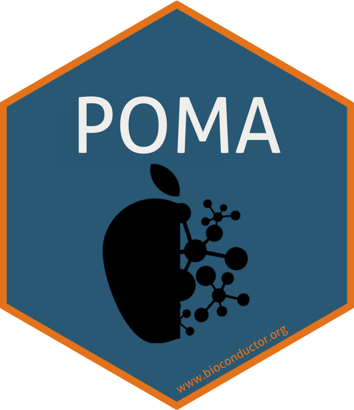
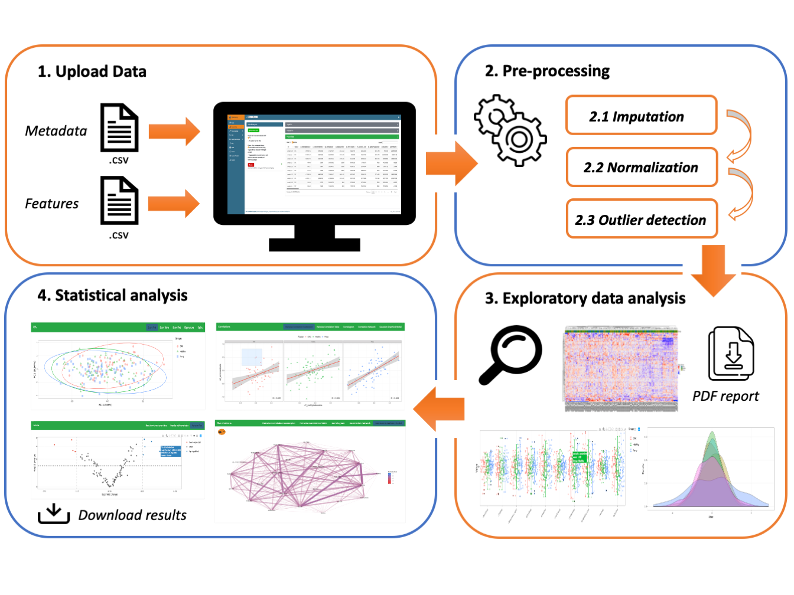

# Welcome to POMAShiny! 

POMAShiny is an user-friendly web-based workflow for pre-processing and statistical analysis of mass spectrometry data. This tool allows you to analyze your data:

<b>Fast:</b> Analyze and visualize your data easily in few steps

<b>Friendly:</b> POMAShiny provides users a very intuitive structure and a whole interactive analysis

<b>Free:</b> All POMAShiny options are completely open and free for all users

---

### Upload Data

  - Upload your data in the *"Upload Data"* tab
  - Data must be a CSV (*comma-separated-value*) file

**Target File**

A .CSV with two mandatory columns + *n* optional covariates:

  - Each row denotes a sample (the same as in the features file)
  - First/Left-hand column must be sample IDs => red
  - Second/Left-hand column must be sample group/factor (e.g. treatment) => green
  - Covariates (optional): From the third column (included) users can also include several experiment covariates => purple
  

**Features File**

A .CSV with *m* columns:

  - Each row denotes a sample and each column denotes a feature
  - First row must contain the feature names

---

### More Help and Instructions

Additional help and more detailed instructions are provided in the "Help" panel. Furthermore, two different tutorials are provided in the "Tutorials" panel.    

---

### About POMAShiny

POMAShiny has been developed by Pol Castellano-Escuder, Raúl González-Domínguez, Cristina Andrés-Lacueva and Alex Sánchez-Pla at University of Barcelona, Spain.

The source code of POMAShiny is freely available on GitHub at https://github.com/pcastellanoescuder/POMAShiny.

We would appreciate reports of any issues with the app via the GitHub issue tracking at https://github.com/pcastellanoescuder/POMAShiny/issues.

---

