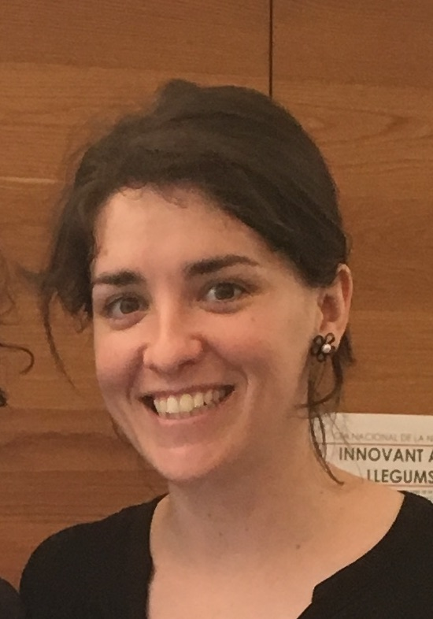

# About Us 

## Pol Castellano Escuder 

 

**PhD Student**

**Statistics and Bioinformatics Research Group and Biomarkers and Nutritional & Food Metabolomics Research Group (University of Barcelona)**

**e-mail:** pcastellano@ub.edu  

#### Biosketch

I obtained my Bachelor degree in Biology at the University of Barcelona (UB) in June 2016. In July 2017 I obtained my Master's degree in Bioinformatics and Biostatistics at the University of Barcelona (UB) and the Open University of Catalonia (UOC). My master thesis was titled "Prediction model of response to a certain treatment in childhood obesity" supervised by Prof. Esteban Vegas Lozano.  

During my bachelor and master degree studies, I focused my research on the search of epigenetic and metabolomic biomarkers in Childhood obesity.  

Currently, I am PhD student in the Biomedicine Doctorate Programme of UB under the supervision of Prof. Alexandre Sánchez Pla and Prof. Cristina Andrés Lacueva. My research is focused on food metabolomics.  

#### Research areas:

Omics Data Analysis  

Metabolomic Food Biomarkers   
 
**Publication links:** [ORCID] (https://orcid.org/0000-0001-6466-877X)      

**In the web:** [GitHub] (https://github.com/pcastellanoescuder), [Linkedin] (https://www.linkedin.com/in/pol-castellano-escuder-50bb10127/)      

#### Education

**MSc in Bioinformatics and Biostatistics**. UOC-UB, July 2017  

**BSc in Biology, Barcelona University**. June 2016   

## Magalí Palau Rodriguez 

 

**PhD Student**

**Biomarkers and Nutritional & Food Metabolomics Research Group (University of Barcelona)**

**e-mail:** palaumagali@ub.edu

#### Biosketch

I obtained my Bachelor degree in Pharmacy ...at the University of Barcelona (UB) in July 2013. In July 2014 I obtained my Master’s degree in Food Development and Innovation at the University of Barcelona (UB). My master thesis was titled “Metabolomics into the intricate gut microbial-host interaction in the diabesity” supervised by Prof. Cristina Andrés-Lacueva and Dr. Sara Tulipani.       

Currently, I am finalizing my PhD in metabolomics after the effect of an intervention of weight loss in subjects with obesity, within the Food and Nutrition Doctorate Programme of UB under the supervision of Prof. Cristina Andrés. My research is focused on metabolomics data analysis and data visualization.     

#### Research areas:

Metabolomics data analysis  

Obesity, bariatric surgery and Mediterranean Diet  
 
**Publication links:** [ORCID] (http://orcid.org/0000-0001-7042-5651)    

**In the web:** [Linkedin] (https://www.linkedin.com/in/magalipalau/)         

#### Education

**MSc in Food Development and Innovation**. July 2014       

**BSc in Pharmacy, Barcelona University**. July 2013       
