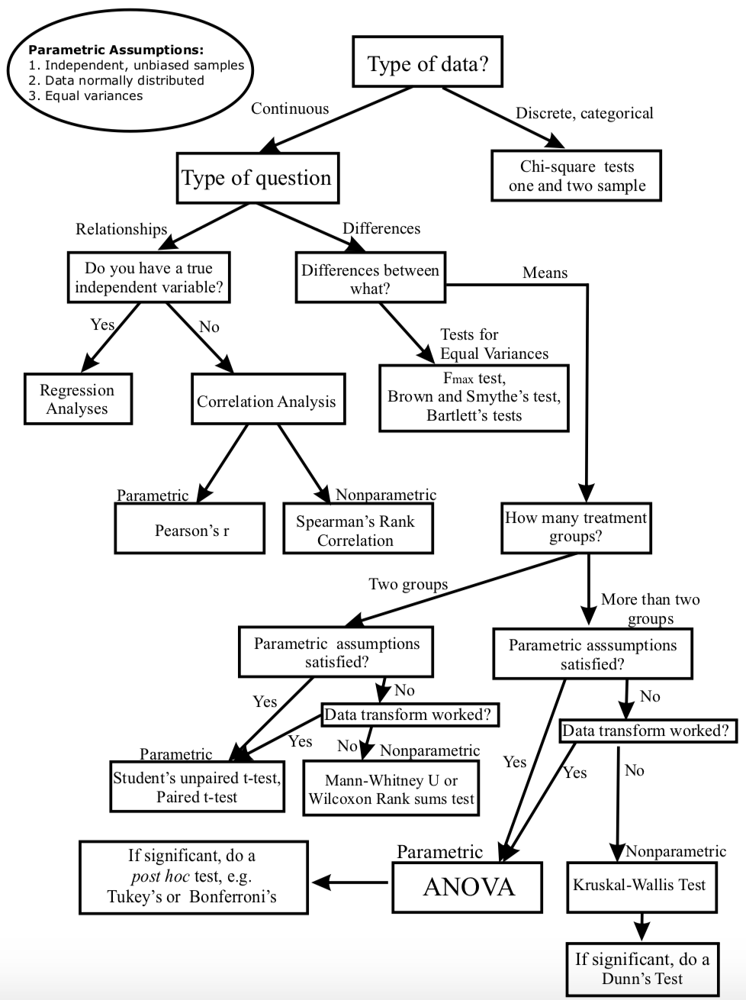

### Input Data

This panel allows user upload his data to be analyzed in POMA.  

**Metabolomic Data**: Each row denotes a sample and each column denotes a metabolite.  
**Covariates file (optional)**: Each row denotes a sample (the same as in metabolomic data) and each column denotes covariate.

**Exploratory report:** You will find a green button with the name "Exploratory report" in the top of central panel. If you "click" this button POMA will generate an automatically exploratory report of your data.  

If you want to upload your data, please select "**No, upload my own data**" button and remember that:    

- Your metabolomic matrix must be a .CSV (*comma-separated-value*) file.
- First/Left-hand column must be sample IDs.
- Second/Left-hand column must be sample groups.
- Ideally, first row should be column names (metabolites). If not, don't worry, POMA will can deal with it if you "click" on **Header** button.  

If you want include a covariates file, please, upload it in "**Upload your covariates file**" and remember:

- Covariates file must be a .CSV (*comma-separated-value*) file.
- First/Left-hand column must be sample IDs. This sample IDs must be same rownames (IDs) than metabolites matrix IDs.  

In case of that you only want is try POMA and you don't have your own dataset... We offer a dataset (default) of a colorectal cancer metabolomic study (from <a href="https://www.metabolomicsworkbench.org/data/DRCCMetadata.php?Mode=Study&StudyID=ST000284&StudyType=MS&ResultType=1">Metabolomics workbench</a>  ). This option also include a covariates file of the study.  

<a href="https://pubs.acs.org/doi/abs/10.1021/pr500494u"><i>Zhu, J., Djukovic, D., Deng, L., Gu, H., Himmati, F., Chiorean, E. G., & Raftery, D. (2014). Colorectal cancer detection using targeted serum metabolic profiling. Journal of proteome research, 13(9), 4120-4130.</i></a>   

**NOTE:** _Know that we have modified this dataset so that you can try all the options that POMA offers you._    

---

### Imputation missing values

Usually, metabolomics data have a high number of missing values. This is, in major part, due to low signal intensity of peaks.       

In the imputation process POMA is divided in two steps:   

1. Remove all metabolites of the data that have more of specific percentage (defined by user) of missing values in one or more study groups. By default this parameter is 20%. POMA will remove of the dataset metabolites that have more than percentage selected by user of missing values at least one of the groups.

2. POMA offers six types of imputation methods that are: 

  - replace missing values (NA) by zero
  - replace missing values (NA) by half of the minimum positive value in the original data (in each column)
  - replace missing values (NA) by the median of the column (metabolite)
  - replace missing values (NA) by the mean of the column (metabolite)
  - replace missing values (NA) by the minimum value in the column (metabolite range)
  - replace missing values (NA) using KNN method   
  
<a href="https://onlinelibrary.wiley.com/doi/full/10.1002/elps.201500352"><i>Armitage, E. G., Godzien, J., Alonso‐Herranz, V., López‐Gonzálvez, Á., & Barbas, C. (2015). Missing value imputation strategies for metabolomics data. Electrophoresis, 36(24), 3050-3060.</i></a>    

---

### Normalization

This panel include different normalization methods for your **metabolomic** matrix. This step is required to make all metabolites comparable among them. By default the application do not normalize data, however it is recommended to select one normalization method. 

POMA app offers all these following different types of normalization methods:  

| Method 	| Unit 	| Goal 	| Advantages 	| Disadvantages 	|
|--------------------	|---------	|------------------------------------------------------------------------------------------	|-------------------------------------------------------------------	|---------------------------------------------------------------------------	|
| Autoscaling 	| (-) 	| Compare metabolites based on correlations 	| All metabolites become equally important 	| Inflation of the measurement errors 	|
| Level scaling 	| (-) 	| Focus on relative response 	| Suited for identification of e.g. biomarkers 	| Inflation of the measurement errors 	|
| Log scaling 	| Log (-) 	|  	|  	|  	|
| Log transformation 	| Log O 	| Correct for heteroscedasticity, pseudo scaling. Make multiplicative models additive 	| Reduce heteroscedasticity, multiplicative effects become additive 	| Difficulties with values with large relative standard deviation and zeros 	|
| Vast scaling 	| (-) 	| Focus on the metabolites that show small fluctuations 	| Aims for robustness, can use prior group knowledge 	| Not suited for large induced variation without group structure 	|
| Log pareto scaling 	| Log (-) 	| Reduce the relative importance of large values, but keep data structure partially intact 	| Stays closer to the original measurement than autoscaling 	| Sensitive to large fold changes 	|   

<a href="https://bmcgenomics.biomedcentral.com/articles/10.1186/1471-2164-7-142"><i>van den Berg, R. A., Hoefsloot, H. C., Westerhuis, J. A., Smilde, A. K., & van der Werf, M. J. (2006). Centering, scaling, and transformations: improving the biological information content of metabolomics data. BMC genomics, 7(1), 142.</i></a>   

User can check the normalization effect on the data for all methods by visualising the interactive boxplots tabs that are in "**Normalized Data**" panel. As more similar are the boxes in the "y" axis as better is the normalization.  

---

### Statistics

#### Univariate Statistics

<b>You can use the following flow chart to help you decide which statistic to use.</b>

     

<a href="http://abacus.bates.edu/~ganderso/biology/resources/statistics.html"><i>Flowchart from here</i></a>  

##### Parametric methods

##### Limma

Limma (Linear Models for Microarray Data) is an R/Bioconductor software package that provides an integrated solution for analysing high-throughput experimental data. It contains rich features for information borrowing to overcome the problem of **small sample sizes**.     

How it works?    

On one hand, it fits a linear model to each metabolite of data and takes advantage of the flexibility of such models in various ways, for example to handle complex experimental designs and to test very flexible hypotheses.     

On the other hand, it leverages the highly parallel nature of metabolomic data to borrow strength between the metabolite-wise models, allowing for different levels of variability between metabolites and between samples, and making statistical conclusions more reliable when the number of samples is small.   

In this method you can analyze your **Covariates file** if you have it.       

**You have to normalize the data to use this method.**     

<a href="https://academic.oup.com/nar/article/43/7/e47/2414268"><i>Ritchie, M. E., Phipson, B., Wu, D., Hu, Y., Law, C. W., Shi, W., & Smyth, G. K. (2015). limma powers differential expression analyses for RNA-sequencing and microarray studies. Nucleic acids research, 43(7), e47-e47.</i></a>      

##### T-test

This is an statistical hypothesis test in which the test statistic follows a Student's t-distribution under the null hypothesis. This analysis is used when you are comparing **two groups.**

A t-test is applied when the variable follow a **normal distribution**.

**Correlated (or Paired) T Test:** The correlated T test is performed when the samples typically consist of matched pairs of similar units, or when there are cases of repeated measures. This method can also applies on cases where the samples are related in some manner or have matching characteristics. Correlated or paired T tests are of dependent type, as these involve cases where the two sets of samples are related.    
**Equal Variance (or pooled) T Test:** The equal variance T test is used when the number of samples in each groups is the same, or the variance of the two data sets is similar.  

**Unequal Variance T Test:** The unequal variance T test is used when the number of samples in each group is different and the variance of the two data sets is also different. This test is also called the **Welch's t-test**.     

##### ANOVA

A variance analysis (ANOVA) tests the hypothesis that the averages of **two or more** populations are the same. The ANOVA evaluates the importance of one or more factors when comparing the means of the response variable in the different levels of the factors. The null hypothesis states that all the means of the population (mean of the levels of the factors) are the same, while the alternative hypothesis states that at least one is different.    

In this method you can analyze your **Covariates file** if you have it.     

##### Non Parametric methods

##### Mann-Whitney U Test

Mann-Whitney U test is the **non-parametric alternative test to the independent sample t-test**. It is a non-parametric test that is used to compare **two group** means that come from the same population, and used to test whether two sample means are equal or not.  Usually, the Mann-Whitney U test is used when the data is ordinal or when the **assumptions of the t-test are not met**.     

When your have **paired groups**, this test becomes a **Wilcoxon signed-rank test**.     

**Assumptions:**     

1. The sample drawn from the population is random.
2. Independence within the samples and mutual independence is assumed. That means that an observation is in one group or the other (it cannot be in both).
3. Ordinal measurement scale is assumed.    

##### Kruskal Wallis Test

Kruskal-Wallis test is a non-parametric method to test whether a group of data comes from the same population. Intuitively, it is similar to the ANOVA with the data replaced by categories. It is an extension of the Mann-Whitney U test for **3 or more groups**.     

Since it is a non-parametric test, the Kruskal-Wallis test does not assume normality in the data, as **opposed to the traditional ANOVA**. It assumes, under the null hypothesis, that the data come from the same distribution.     

--- 

Dear user,  

Unfortunately the documentation of the sections "Multivariate Statistics", "Correlation Analysis", "Feature Selection", "Random Forest", "Rank Products" and "ASA (Automatic statistical analysis)" are not available now... We are working to solve this as soon as possible.  

Sorry for the inconvenience.  

POMA team.   

