<h3>Why do I have to use POMA?</h3>  

<h4><u><i><b>F</b>ast:</i></u> Analyze and visualize your data in few minutes</h4>
<h4><u><i>User <b>F</b>riendly:</i></u> POMA is very intuitive and no needed programming skills in any step of workflow</h4>
<h4><u><i><b>F</b>ree:</i></u> All POMA options and analysis are completely free for all users</h4>

### Visualization

#### PCA Plots

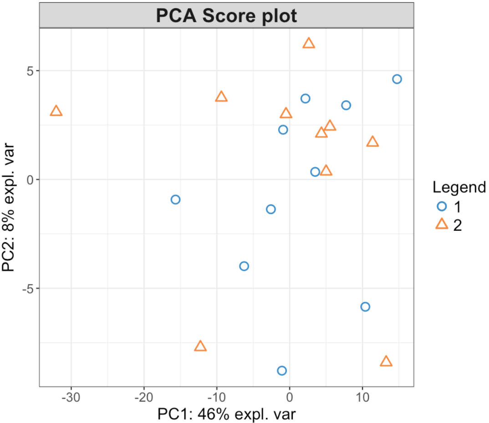
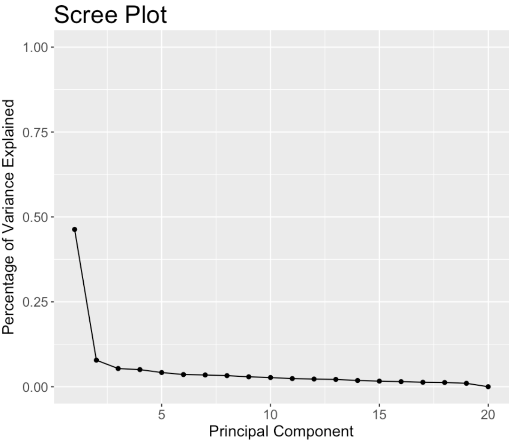
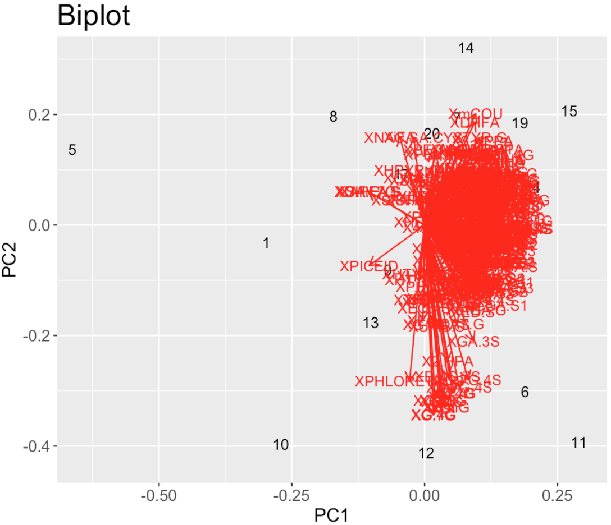

#### PLS-DA Plots

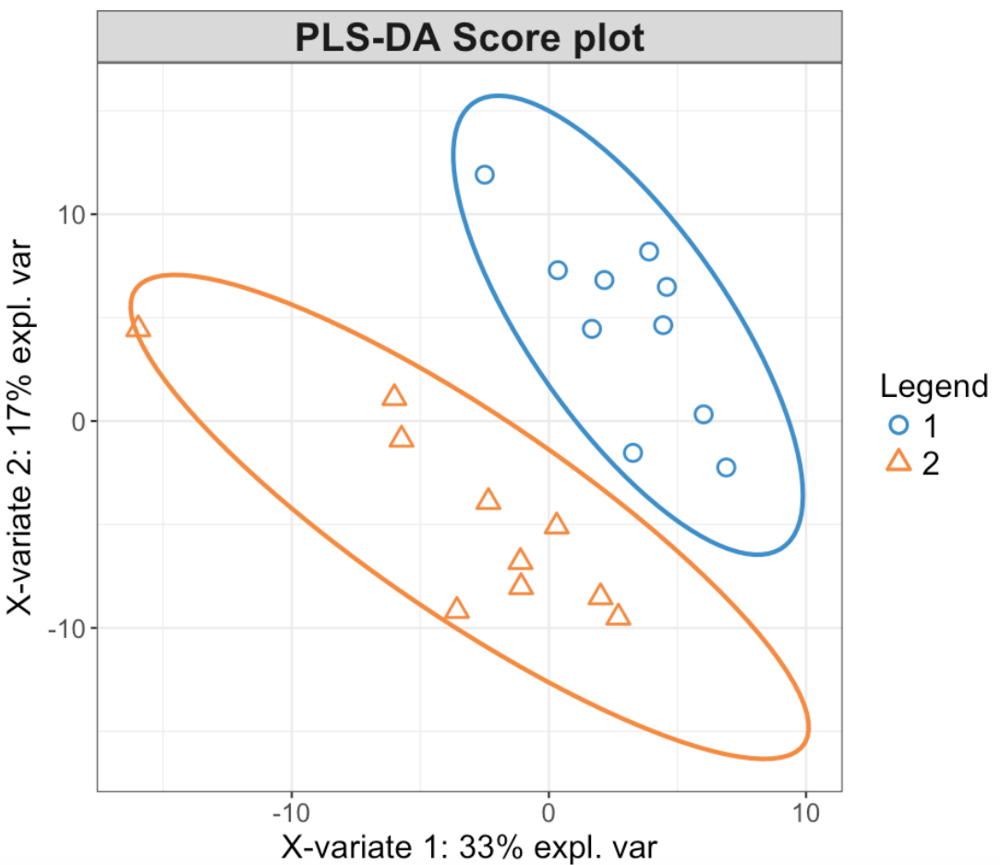
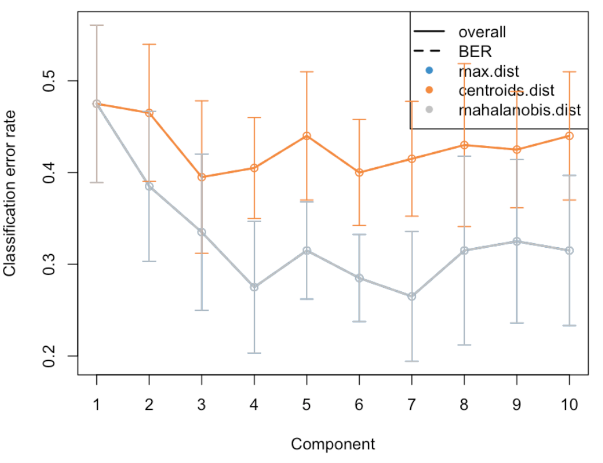
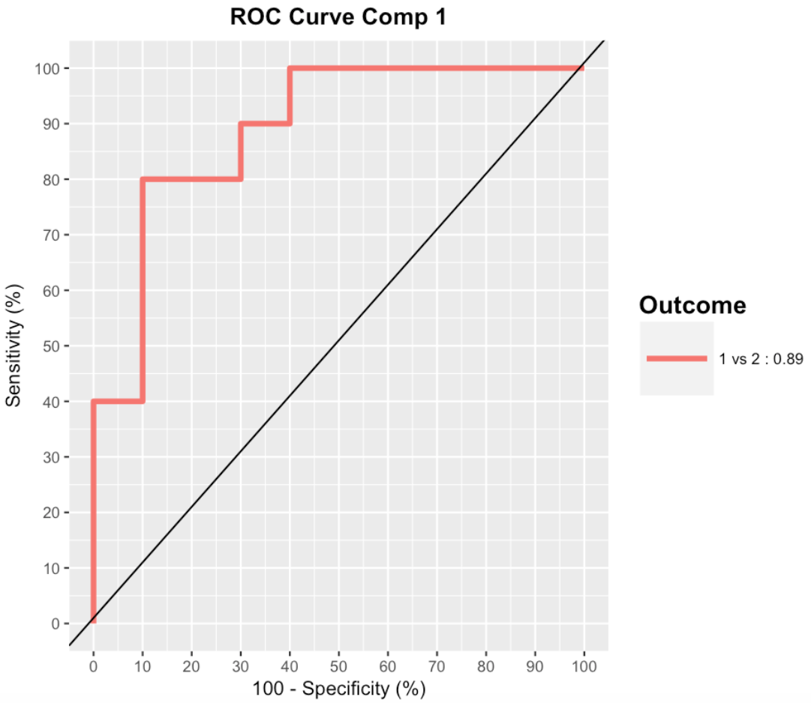
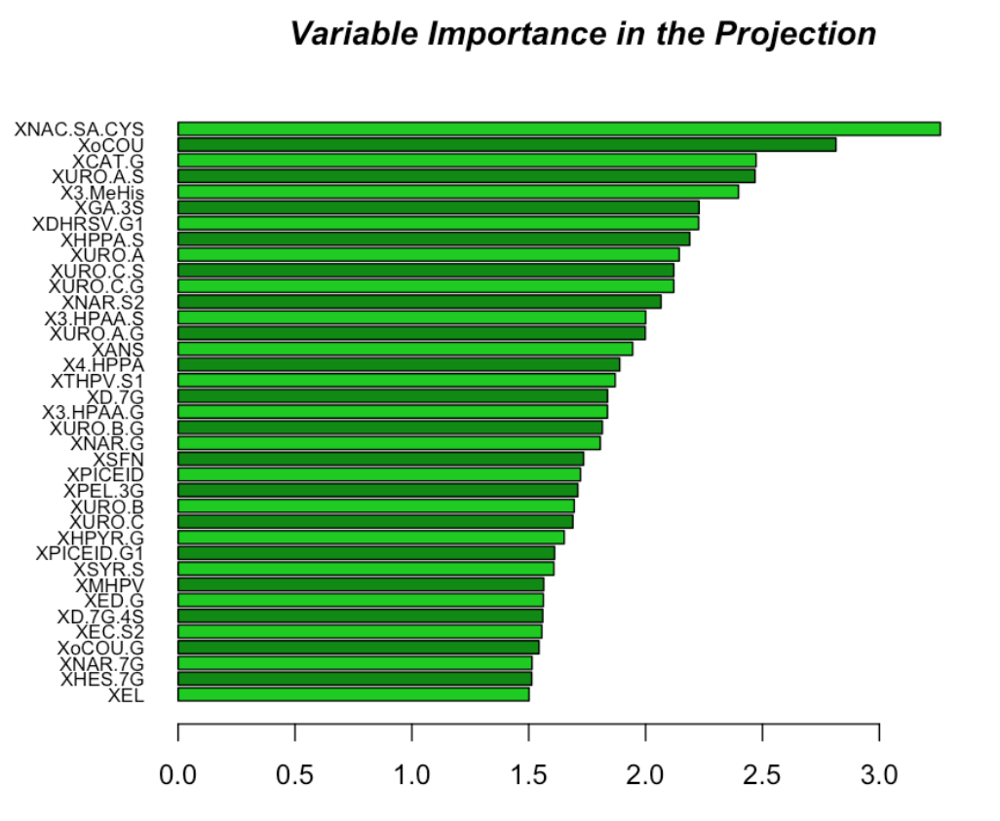

#### sPLS-DA Plots

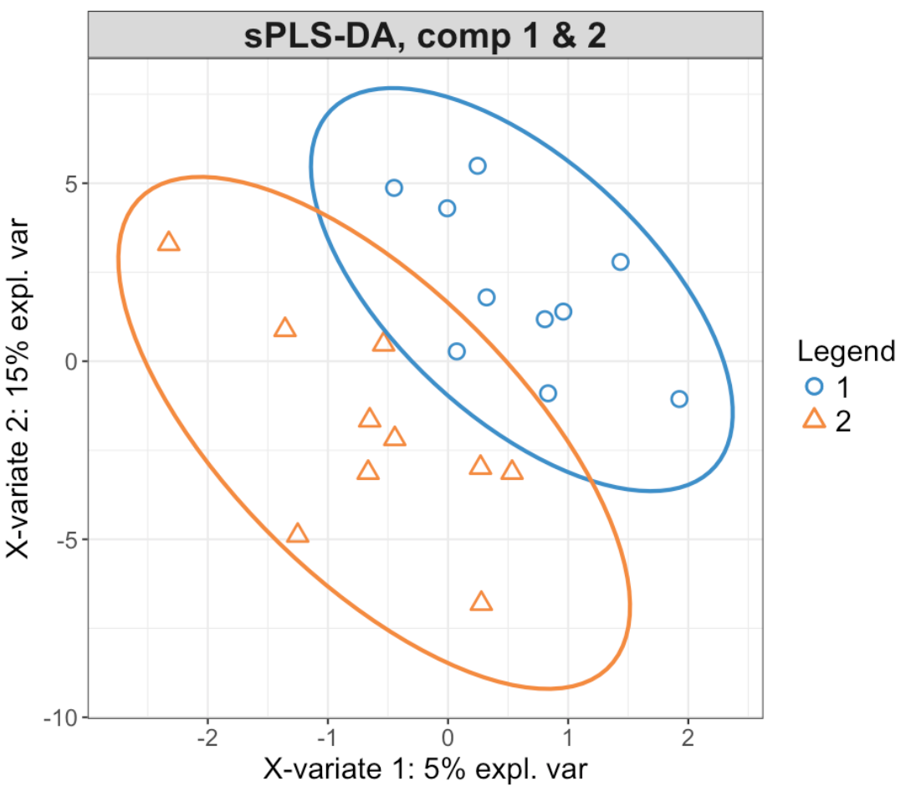
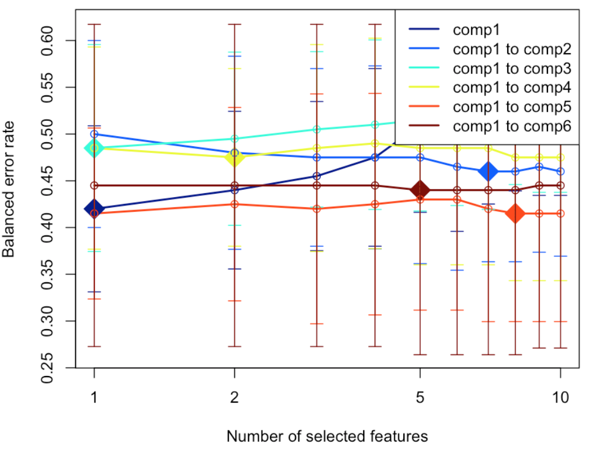

#### Lasso Plots

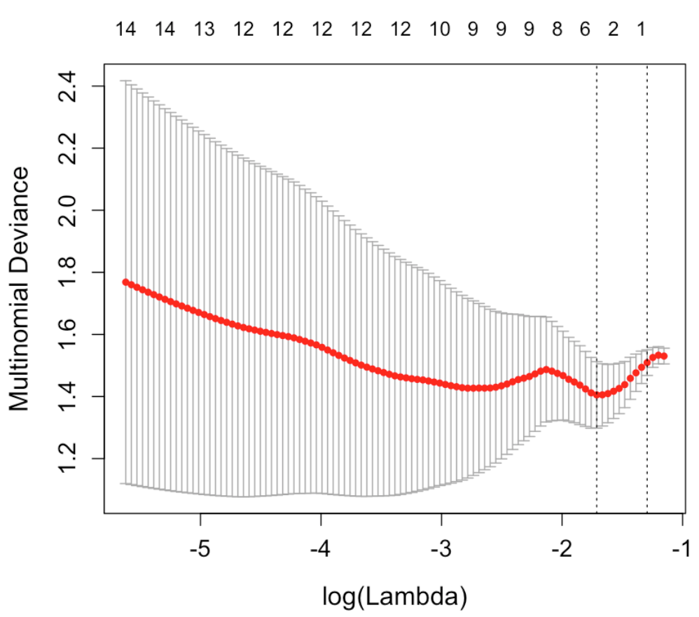

#### Ridge regression Plots

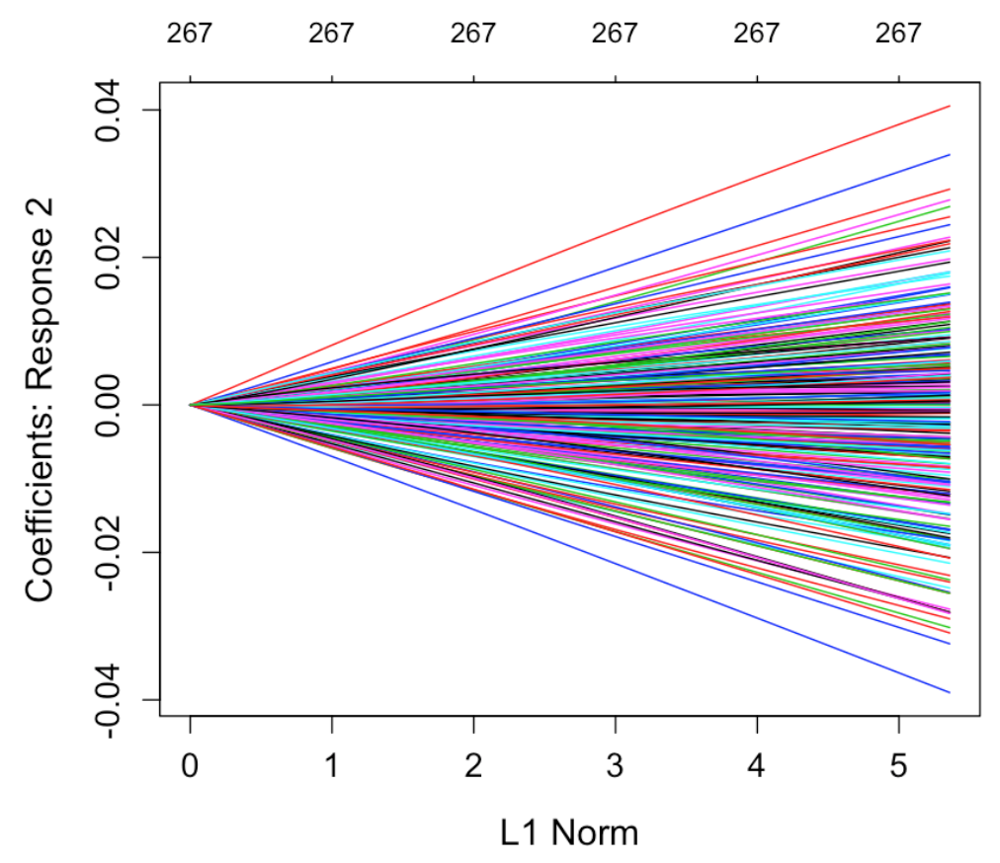
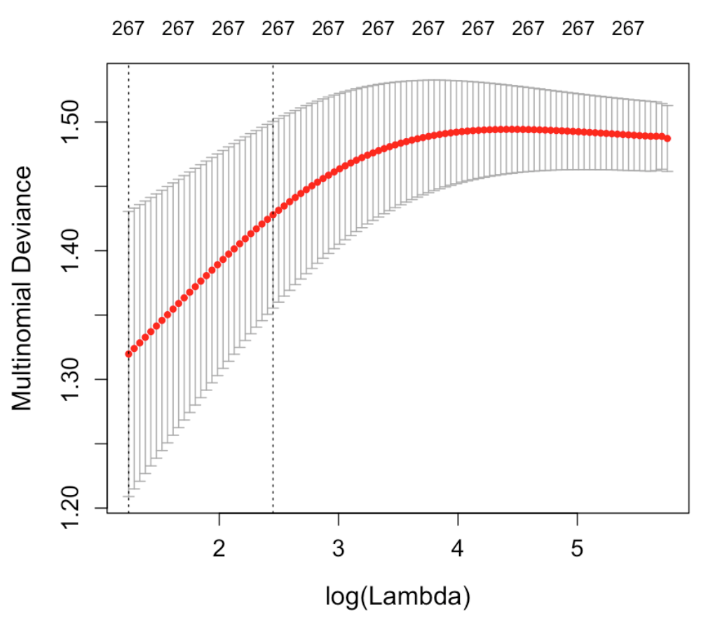

### Input Data 

- Upload your data in the *"Input Data"* tab.   
- Must be a .CSV *comma-separated-value* file.
- File must have a header row.
- First/Left-hand column must be sample IDs.

**Metabolomic Data**

  - Each row denotes a sample and each column denotes a metabolite (or feature).

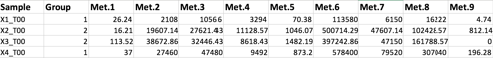

**Covariates file (optional)**

  - Each row denotes a sample (the same as in metabolomic data) and each column denotes covariate.

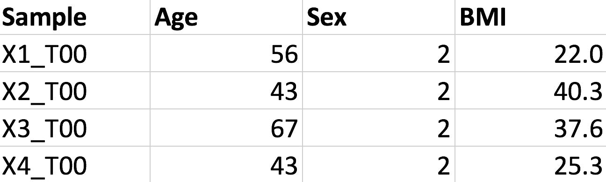

### Impute Values

Metabolomics data usually presents a high number of missing values. By default, the missing values are treated as the result of low signal intensity.   

For this reason, the imputation of missing values is an essential step in metabolomic data analysis workflow. To deal with that, POMA provides the Impute Value panel which allows the user: 

1. To remove all metabolites of the data that have more of specific percentage (defined by user) of missing values on each study group. By default this parameter is 20% 

2. To impute missing values of the data using different methods such as:

  - replace by zero
  - replace by half of the minimum positive value in the original data
  - replace by median
  - replace by mean
  - replace by minimum
  - KNN method   

### Normalization

Normalization is required to make all metabolites comparable among them. By default the application do not normalize data, however it is recommended to select one method if the user wants perform a multivariate analysis. POMA app offers all these following different types of normalization methods:  

  - Autoscaling 
  - Level scaling
  - Log transformation
  - Vast scaling
  - Log Pareto

### Statistics

The Statistical Analysis panel contains a set of panels in the app:  1) the univariate analysis; 2) the multivariate analysis and 3) the feature selection panel. Below is a brief explanation of each of them.

#### Univariate analysis

The Univariate Analysis panel contains three types of analysis to perform comparaisions of each group per each metabolite.  

  - limma: _linear models for microarray and RNA-Seg Data_. This function is implemented in limma R package and is prepared to perform a singl-sample t-test using an empirical Bayes method to borrow information between metabolites. The final output is a list of metabolites with a column with a value of the contract (logFC). The AveExpr column gives the average log2-expression level for that gene across all the arrays and channels in the experiment. Column t is the moderated t-statistic. Column P.Value is the associated p-value and adj.P.Value is the p-value adjusted for multiple testing by false discovery rate (FDR).  
  - T-test. The results can be shown with a interactive volcano plot easy to modify and download.  
  - One-way Analysis of Variance (ANOVA). If data has more than two groups. 
  
<i>All of the previous methods can be corrected by covariables if the user has provided a covariate matrix.</i> 

#### Multivariate analysis

This step is powered by mixOmics R package. POMA multivariate analysis includes three principal multivariate methods:

  - Principal Component Analysis (PCA)
  - Partial Least Squares Discriminant Analysis (PLS-DA)
  - Sparse Partial Least Squares Discriminant Analysis (sPLS-DA)

#### Feature Selection

In statistics, feature selection, also known as variable selection, is the process of selecting a subset of relevant features (for example, variables) for use in model construction.   

POMA includes a section thought specified for feature selection. This section includes two of the most used methods for this purpose.

  - Ridge regression
  - Lasso

