

### Welcome to POMA!

---
<h4><b>Fast:</b> Analyze and visualize your data in few steps</h4>
<h4><b>Friendly:</b> POMA is very intuitive and no needed programming skills in any step of workflow</h4>
<h4><b>Free:</b> All POMA options and analysis are completely free for all users</h4>

---

### Input Data 

- Upload your data in the *"Input Data"* tab.   
- Data must be a .CSV *comma-separated-value* file.
- First/Left-hand column must be sample IDs.
- Second/Left-hand column must be sample groups.
- Ideally, first row should be column names (metabolites).  

**Metabolomic Data**

  - Each row denotes a sample and each column denotes a metabolite.

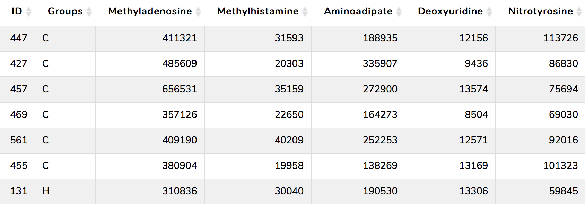

**Covariates file (optional)**

  - Each row denotes a sample (the same as in metabolomic data) and each column denotes covariate.

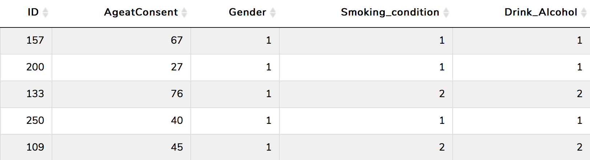  

---

### Impute Values

Metabolomics data usually presents a high number of missing values. By default, the missing values are treated as the result of low signal intensity.   

For this reason, the imputation of missing values is an essential step in metabolomic data analysis workflow. To deal with that, POMA provides the **Impute Value** panel which allows the user: 

1. To remove all metabolites of the data that have more of specific percentage (defined by user) of missing values in one or more study groups. By default this parameter is 20%.  

2. To impute missing values of the data using different methods such as:

  - replace by zero
  - replace by half of the minimum positive value in the original data
  - replace by median
  - replace by mean
  - replace by minimum
  - KNN method  (default)     

---

### Normalization

Normalization is required to make all metabolites comparable among them. By default the application do not normalize data, however it is recommended to select one normalization method. POMA app offers all these following different types of normalization methods:  

  - Autoscaling 
  - Level scaling
  - Log scaling
  - Log transformation
  - Vast scaling
  - Log Pareto

---

### Statistics

The Statistical Analysis tab contains a set of different panels to analyze the data:  1) Univariate analysis; 2) Multivariate analysis; 3) Correlation analysis; 4) Random Forest; 5) Feature selection and 6) Rank Products. Each one of them includes different options and methods. Below is a brief explanation of each one:  

#### Univariate analysis

The Univariate Analysis panel contains five types of analysis to perform comparaisions of each group per each metabolite.    

##### <u>Parametric tests</u>

  - limma: _linear models for microarray and RNA-Seq Data_. This function is implemented in limma R package and is prepared to perform a singl-sample t-test using an empirical Bayes method to borrow information between metabolites. The final output is a list of metabolites with a column with a value of the contract (logFC). The AveExpr column gives the average log2-expression level for that gene across all the arrays and channels in the experiment. Column t is the moderated t-statistic. Column P.Value is the associated p-value and adj.P.Value is the p-value adjusted for multiple testing by false discovery rate (FDR).   

  - T-test: The results can be shown with an interactive **volcano plot**.    
  
  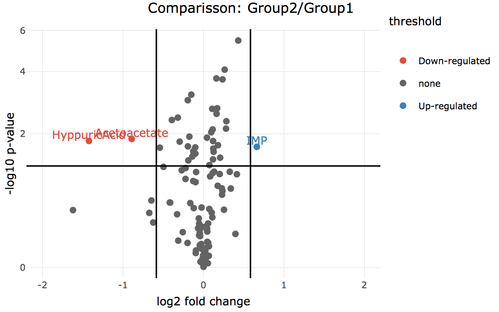   
   
  - One-way Analysis of Variance (ANOVA): If data has a normal distribution and more than two groups.   
  
<b><i>All of the previous methods can be corrected by covariables if the user has provided a covariate matrix.</i></b>     

##### <u>Non-Parametric tests</u>

  - Mann-Whitney U Test: If data has two groups and non-normal distribution. If data is paired, this test becomes to Wilcoxon Signed Rank Test.
  - Kruskal Wallis Test: If data has a non-normal distribution but more than two groups.
  
#### Multivariate analysis

This step is powered by **mixOmics R package**. POMA multivariate analysis includes three principal multivariate methods:

  - Principal Component Analysis (PCA)    
  
  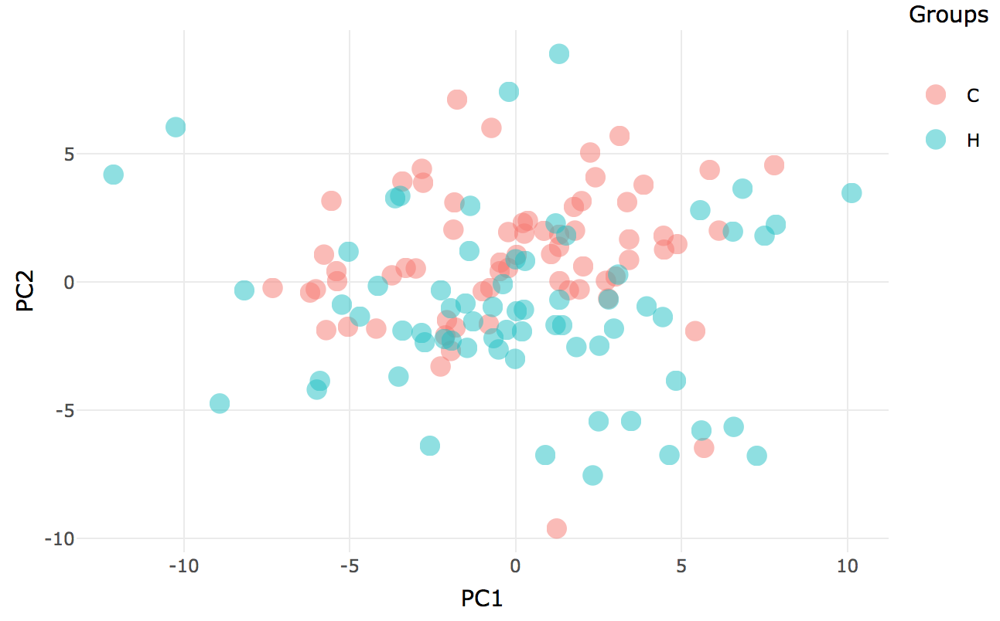   
  
  - Partial Least Squares Discriminant Analysis (PLS-DA)   
  
  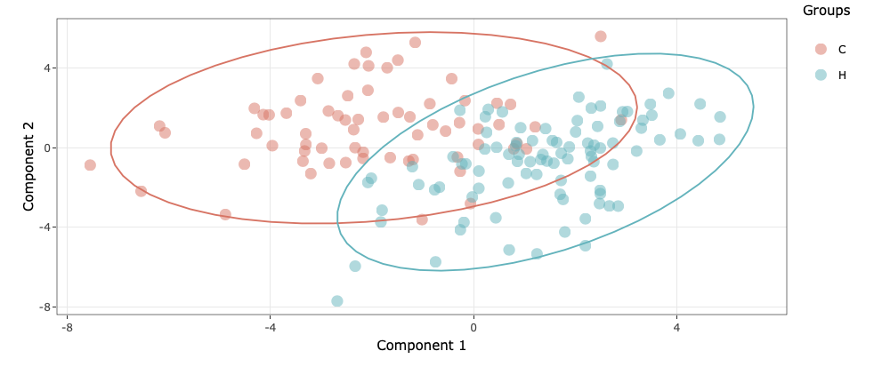 
  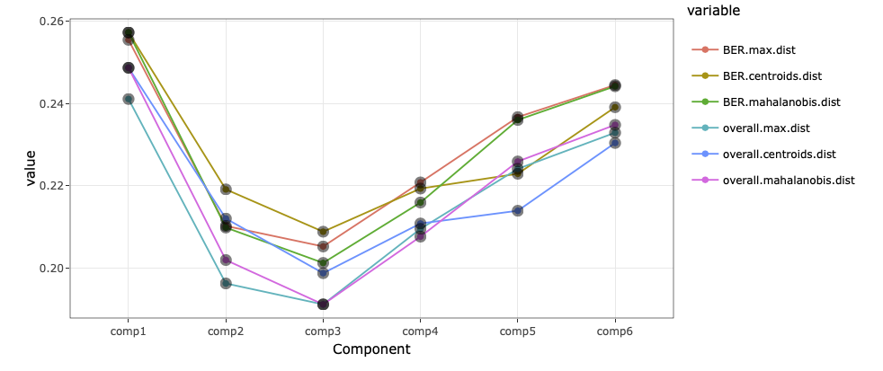   

  - Sparse Partial Least Squares Discriminant Analysis (sPLS-DA)  
  
  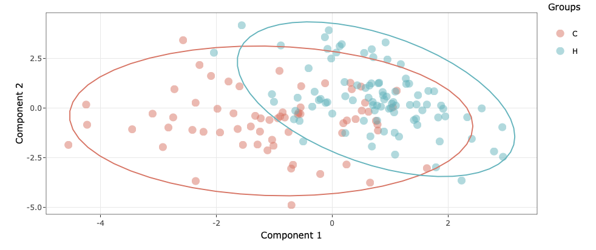   

#### Correlation analysis

The Correlation analysis tab includes two different ways to visualize the correlations in your data.    

  - Pairwise Correlation Scatterplot: This scatterplot show the correlation (and p-value of this correlation) between two metabolites in the data. The user can choose any pair of metabolites in the dataset and modify the correlation method (pearson, spearman or kendall) in a reactive, fast and easy panel.   
  
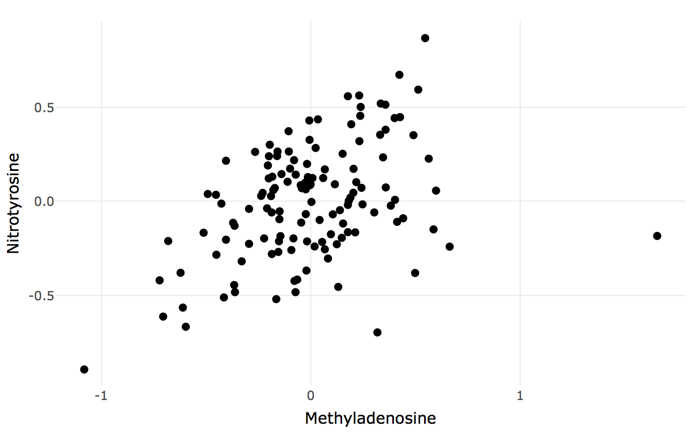   

  - Global Correlation Heatmap: Where you can see the correlation matrix of your data in a heatmap format. This plot show all correlations in data at the same time.     
  
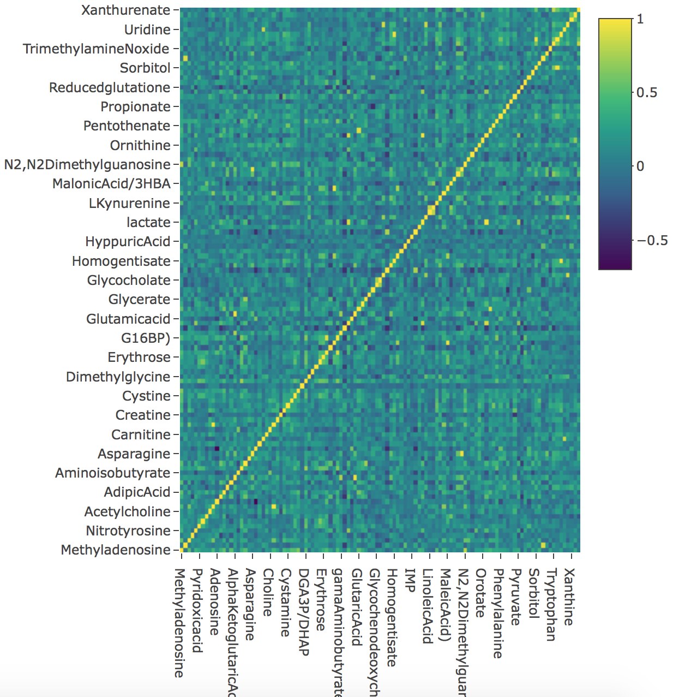 

#### Random Forest

Random forests or random decision forests are an ensemble learning method for classification, regression and other tasks that operates by constructing a multitude of decision trees. This methods are included in the **_machine learning_** techniques.

POMA includes a Random Forest algorithm for group classification based on **caret** R package. POMA interface allows user to tune all the Random Forest parameters in a easy way.

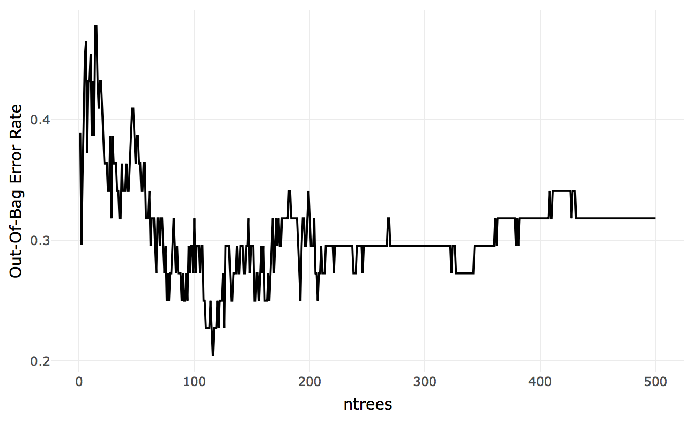 

#### Feature Selection

In statistics, feature selection, also known as variable selection, is the process of selecting a subset of relevant features (for example, metabolites) for use in model construction.   

POMA includes a section thought specified for feature selection. This section includes two of the most used methods for this purpose.

  - Ridge regression
  - Lasso
  
  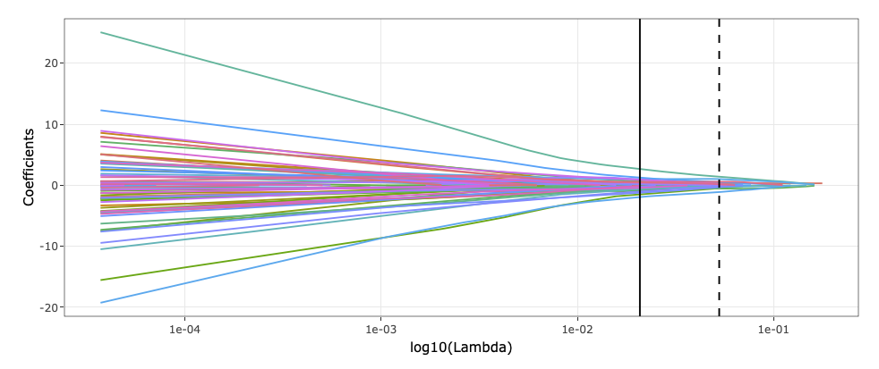   

#### Rank Products

The rank product is a biologically motivated test for the detection of differential features in high throughput experiments. It is a simple **non-parametric** statistical method based on ranks of fold changes. It can be used to combine ranked lists in various application domains, including proteomics, statistical meta-analysis and general feature selection.  

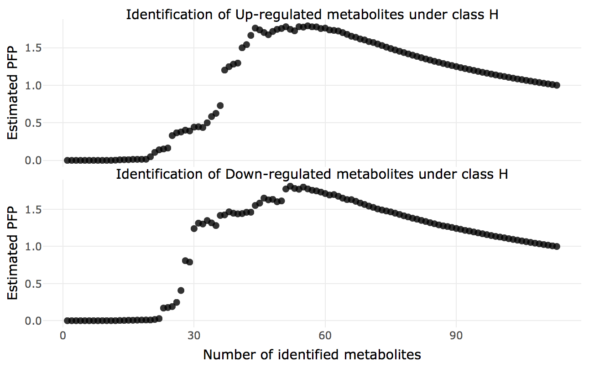 

